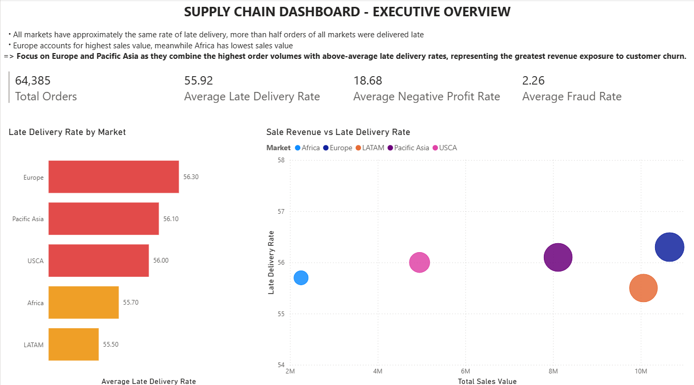
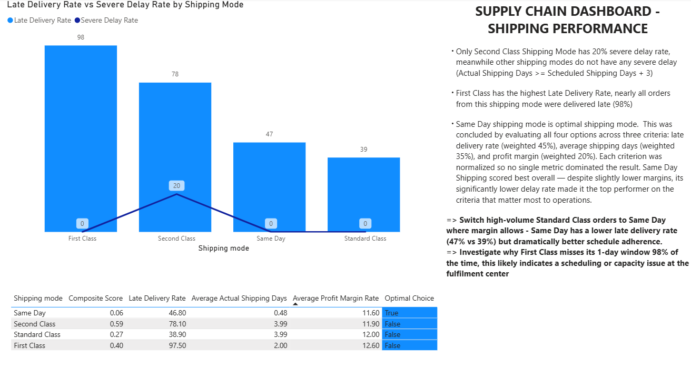
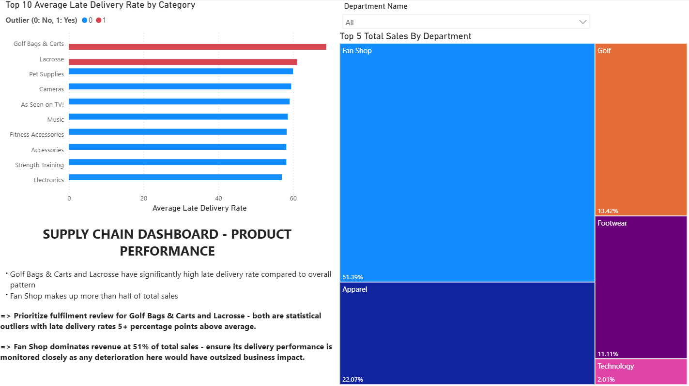
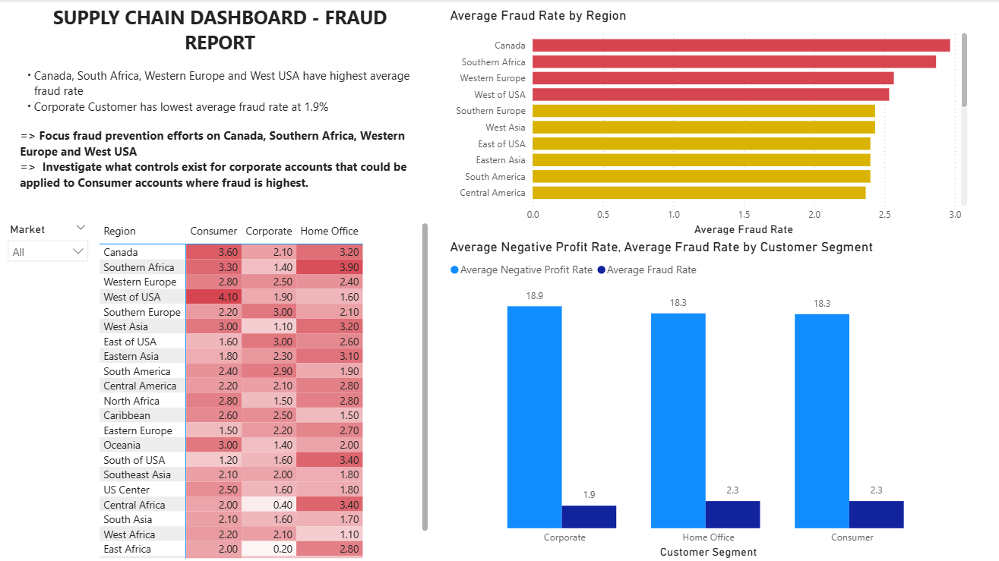

# DataCo Global Supply Chain - Delivery Exception & Fraud Detection Dashboard

*Analyzing 64K+ orders across 5 global markets -  identifying 2.26% fraud orders and surfacing delivery failures affecting 55.9% of shipments.*

## I. Project Overview

More than half of all orders in this dataset were delivered late, directly threatening customer retention and repeat revenue. This project identifies where delivery failures concentrate - by market, shipping mode, and product category - and flags fraudulent transactions before they erode profit margins.

To answer these questions, I built a SQL and Python data pipeline that processes 64K+ orders across 5 global markets, then visualizes findings in a 4-page Power BI dashboard designed for operational decision-making.

## II. Data Source

**Dataset:** data/supply_chain_cleaned.zip

The raw dataset contains 180,000+ order line items. The following columns are the ones actually used to produce the 4 Power BI dashboard tables:
 
- **Orders:** Order ID, Order Date, Order Status
- **Logistics:** Delivery Status, Shipping Mode, Days For Shipping (real), Days For Shipment (scheduled)
- **Financials:** Sales, Profit Per Order, Order Item Profit Ratio
- **Geography:** Market, Order Region
- **Product:** Category Name, Department Name
- **Customer:** Customer Segment

## III. Key Features

- **Independent exception flags:** `flag_late`, `flag_severe_delay`, `flag_fraud`, `flag_neg_profit` tracked as separate columns to allow meaningful variance analysis across markets and categories
- **Normalised shipping scoring model:** MinMaxScaler (Scikit-Learn) ranks all four shipping modes across three weighted criteria (late delivery rate 45%, actual shipping days 35%, profit margin 20%) - allow to identify Same Day as the optimal mode 
- **Statistical outlier detection:** Z-score analysis (threshold |z| > 1.5) identifies product categories with abnormally high late delivery rates - separating genuine anomalies from random variation and focusing attention on the two categories most worth investigating

## IV. Dashboard Overview

The Power BI dashboard contains 4 pages, each targeting a specific analytical question.

### Page 1 - Executive Overview



Answers: *Which markets have the most delivery and fraud risk, and how does that compare to their revenue contribution?*

- **KPI cards:** Total orders (64,385), average late delivery rate (55.9%), average negative profit rate (18.7%), average fraud rate (2.3%)
- **Bar chart:** Late delivery rate by market - Europe leads at 56.3%, all markets cluster tightly between 55–57%, indicating the problem is systemic rather than market-specific
- **Scatter chart:** Total sales vs late delivery rate, bubble size = total orders - Europe combines the highest revenue with the highest late rate, representing the greatest business risk

#### Insights from Page 1:

- All five markets show nearly identical late delivery rates (55–57%), suggesting the root cause is in shared logistics infrastructure rather than regional operations
- Europe accounts for the highest total sales ($10.7M) while also having the highest late delivery rate - making it the priority market for operational improvement
- Africa has the smallest order volume (3,775 orders) but a late delivery rate (55.7%) comparable to Europe (56.3%) - suggesting the late delivery problem is not driven by volume

### Page 2 - Shipping Performance



Answers: *Which shipping mode performs best, and how should the business prioritise them?*

- **Line and Bar chart:** Late delivery rate and severe delay rate side by side for each shipping mode
- **Scorecard table:** All four modes ranked by composite score with the recommended mode

#### Insights from Page 2:

- **First Class has a 97.5% late delivery rate** despite having only a 1-day scheduled window - nearly every First Class order misses its promised delivery date
- **Second Class is the only mode with severe delays** (20%) - meaning actual shipping days exceed scheduled by more than 3 days, a fundamentally different problem from all other shipping modes
- **Same Day is the recommended mode:**  Same Day scored best overall across late delivery rate, actual shipping days, and profit margin when all three criteria are normalised and weighted

### Page 3 - Product Performance



Answers: *Which product categories are driving late deliveries, and which departments leads the sales?*

- **Horizontal bar chart:** Top 10 categories by late delivery rate, with statistical outliers highlighted in red
- **Treemap:** Top 5 departments by total sales, tooltip shows late delivery rate on hover

#### Insights from Page 3:

- **Golf Bags & Carts (68.9%) and Lacrosse (61.1%)** are flagged as statistical outliers - their late delivery rates are more than 1.5 standard deviations above the category average, making them genuine anomalies
- **Fan Shop dominates sales** at 51% - its late delivery rate should be monitored closely as any deterioration would have outsized business impact

### Page 4 - Fraud Report



Answers: *Where is fraud concentrated geographically and by customer segment?*

- **Matrix heatmap:** Fraud rate by region × customer segment - cell background color from white (low) to red (high)
- **Bar chart:**  Average fraud rate by regions, color-coded by severity
- **Clustered bar:** Fraud rate and negative profit rate by customer segment

#### Insights from Page 4:

- **Canada (3%), Southern Africa (2.9%), Western Europe (2.6%) and West of USA (2.5%)** are the highest average fraud-rate regions across all customer segments
- **Corporate customers have the lowest fraud rate (1.9%)** compared to Consumer and Home Office (both 2.3%) - the controls applied to corporate accounts may offer a template for reducing fraud in other segments

## V. Conclusions and Recommendations

### 1. Shipping Mode Optimisation

- **Review First Class:** A 97.5% late delivery rate on a premium service is a brand and customer satisfaction risk. The scheduled 1-day window appears to be systematically unachievable - either the window needs to be extended or fulfilment capacity needs to be increased
- **Investigate Second Class severe delays:** The 20% severe delay rate (3+ days beyond schedule) suggests a specific logistics breakdown - likely carrier handoff or warehouse processing - that does not affect other modes
- **Expand Same Day where margin allows:** Same Day has the best delivery performance and a competitive profit margin - scaling it to higher-volume routes is the highest-confidence operational improvement available

### 2. Product Fulfilment Review

- **Audit Golf Bags & Carts and Lacrosse fulfilment:** These are statistical outliers with delivery problems disproportionate to their volume. Likely causes include specialist packaging, low-frequency carrier routes, or supplier lead time issues
- **Protect Fan Shop performance:** As the dominant department at 51% of total sales, any increase in Fan Shop late delivery rates would have an immediate and material impact on customer satisfaction and revenue

### 3. Fraud Prevention

- **Prioritise Canada, Southern Africa, Western Europe and West of USA** for enhanced transaction monitoring - these four regions consistently show fraud rates above 2.5% across multiple customer segments
- **Apply corporate account controls to consumer and home office accounts:** Corporate fraud rate is lower than other segment rates - investigate whether verification steps applied to corporate onboarding could be adapted for high-risk consumer regions

## VI. Limitations & Future Improvements

### 1. Current Limitations

- **No root cause data:** The dataset flags late deliveries but does not record the reason (carrier failure, warehouse delay, weather, etc.) - a natural next step would be enriching the dataset with carrier-level delay reason codes to move from flagging problems to prescribing fixes
- **Fraud definition is binary:** The `SUSPECTED_FRAUD` order status is used as the fraud flag - the dataset does not confirm whether suspected fraud was verified, which may overstate or understate true fraud rates. A future version would validate flags against confirmed outcomes

### 2. Future Improvements

- **Root cause tagging:** Adding a delay reason field (carrier, warehouse, customs, etc.) would allow the analysis to prescribe specific fixes rather than flag problems
- **Real-time pipeline:** Transition from static CSV exports to cloud SQL connection in Power BI for daily refresh
- **Segment-level fraud model:** Train a classification model on order-level features to predict fraud probability rather than relying on a binary status flag
- **Customer lifetime value layer:** Join with customer data to prioritise late delivery resolution by customer value - a late delivery to a high-LTV customer warrants faster intervention than one to a first-time buyer

## VII. Tools Used

- **SQL engine:** DuckDB - data ingestion via `read_csv_auto()`, all cleaning, feature engineering, and KPI aggregation
- **Data manipulation:** Pandas - reading DuckDB tables into dataframes for ML processing
- **Machine Learning:** Scikit-Learn - MinMaxScaler for normalised shipping mode scoring
- **Statistical analysis:** NumPy - z-score outlier detection on product categories
- **Visualisation:** Power BI Desktop
- **Data source:** Kaggle

## VIII. Repository Structure

```
supply-chain-analytics/
│
├── data/
│   └── supply_chain_cleaned.zip        # Cleaned dataset
│
├── media/
│   ├── page1_executive_overview.png
│   ├── page2_shipping_performance.png
│   ├── page3_product_performance.png
│   └── page4_fraud_report.png
│
├── scripts/
│   ├── Supply-Chain.sql                # SQL Code for cleaning, KPI tables
│   ├── Supply-Chain.ipynb              # Python - ML scoring, z-scores, CSV exports
│
├── dashboard/
│   ├── Supply-Chain.pbix               # Power BI dashboard
│             
└── README.md
```

## IX. How to View

**Option 1:**

1. Download `Supply-Chain.pbix` from this repository
2. Open it in [Power BI Desktop](https://www.microsoft.com/en-us/power-platform/products/power-bi/desktop) (free download)
3. The dashboard will load with all 4 pages ready to explore
   
**Option 2:**
1. View 4 pages dashboard by 4 images in '/media'
